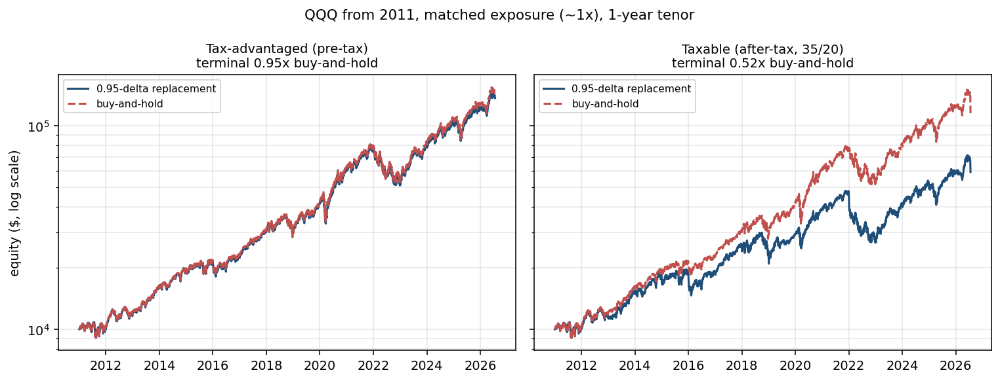
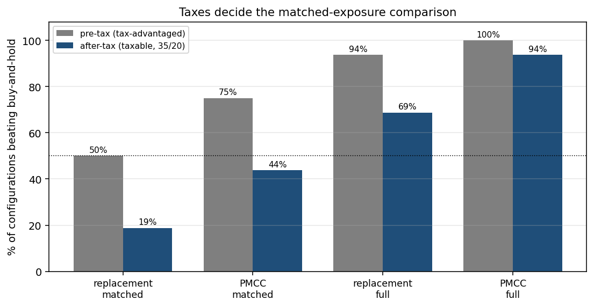
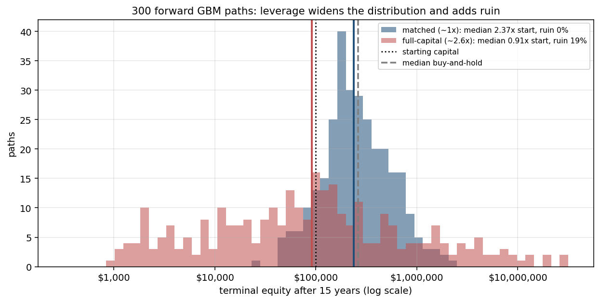
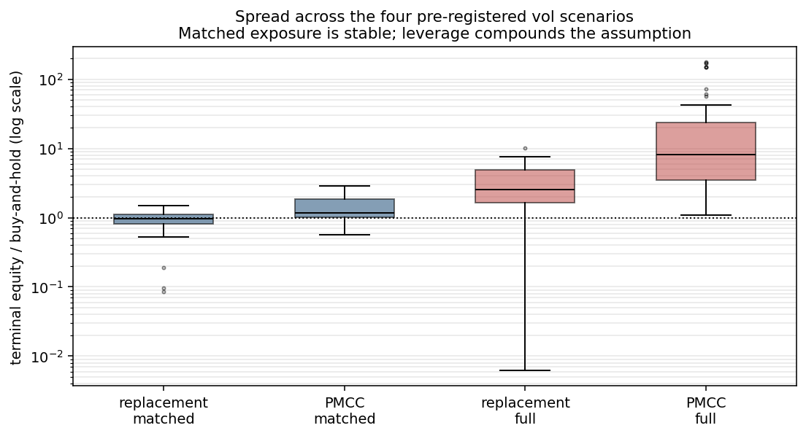

# 95-delta-strategy-tests

A local Python study of deep-in-the-money (0.95 delta) call strategies against
buy-and-hold, on the Nasdaq-100 (QQQ, NQ) and the S&P 500 (SPY, ES), with a
Streamlit app carrying a historical simulator and a forward Monte Carlo.

**This is a research and study tool. It is not investment advice.**

## The constraint that shapes everything

Free historical option prices for these underlyings do not exist back to 2001. No
provider offers them, so the backtest cannot replay real fills. Every option here is
**priced synthetically** at each date from a model driven by a historical volatility
input. Results are model-derived. The volatility surface is the single largest lever,
which is why four surface scenarios were fixed in [SPEC.md](SPEC.md) Section 5.1
before any result existed, and why every headline number is reported with its spread
across them.

## What it found

### Taxes decide the comparison

At matched (~1x) exposure the option route tracks the underlying closely before tax
and falls steadily behind after tax, because rolling realizes gains every cycle
(short-term at the 1-year tenor) while buy-and-hold defers to a single liquidation.



Across the 32 matched-exposure historical configurations, the strategies beat their
own buy-and-hold baseline in 20 of 32 before tax and **10 of 32 after tax**. The
0.95-delta replacement wins 3 of 16 after tax (median 0.70x); the poor man's covered
call wins 7 of 16 (median 0.89x).



### At 1x exposure the result is close to arithmetic

A 0.95-delta call is 95% of the underlying by construction. Its return is the
underlying's return minus dividends forgone, minus time value paid, minus frictions,
minus taxes, plus interest on the freed cash. Measured on QQQ from 2011, the entire
volatility-surface choice moves the long leg's true carry by roughly $17 to $55 per
year per $10,000, against about $60 per year of dividend drag. The elaborate surface
barely matters at 1x. It dominates once leverage compounds it.

### Leverage is a right-skewed lottery, and history could not show it

Two overlapping start years (2001 and 2011, both ending 2026) are two nested slices
of one price history. They cannot support a distributional claim. Running the same
verified strategy engine over 300 forward GBM paths gives the answer:



| configuration | median terminal | vs buy-and-hold | beats B&H | P(ruin, −90%) |
|---|---|---|---|---|
| matched (~1x) | 2.37x start | 0.90x | 2.3% | 0.0% |
| full-capital (~2.6x) | 0.91x start | 0.31x | 23.0% | 18.7% |
| PMCC full-capital | 0.40x start | 0.14x | 5.3% | 19.0% |

Full-capital's median path ends *below* its starting capital after 15 years while its
95th percentile reaches many multiples. The mean sits far above the median, so the
average is carried by a thin right tail while the typical outcome is poor.

The PMCC's full-capital configuration looked like 22x to 38x buy-and-hold in the
historical runs. Across the distribution its median is 0.14x buy-and-hold with 19%
ruin. That historical result was path luck.

### Why full-capital is reported only as a band

The same full-capital configuration spans a wide multiple across the four
pre-registered volatility scenarios. Those point estimates carry no usable signal, so
they are reported as a spread and excluded from the headline.



## What was tested

Underlyings {QQQ, NQ, SPY, ES} × start years {2001, 2011} × strategies {0.95-delta
replacement, poor man's covered call} × tenors {1y, 2y} × sizing {matched-exposure,
full-capital} × four pre-registered vol scenarios × two tax modes, for 512 runs, plus
buy-and-hold baselines. $10,000 starting capital, daily data.

Per run: final equity, total return, CAGR, annualized volatility, Sharpe and Sortino
(excess over the T-bill), max drawdown, Calmar, realized average leverage, rolls,
friction paid, tax paid, and terminal multiple against its own baseline.

## Method

- **Pricing.** Black-Scholes with a continuous dividend yield for the equity
  underlyings, Black-76 for the futures, both extended to American exercise with the
  Barone-Adesi-Whaley approximation. Verified against Hull's reference values,
  put-call parity to machine precision, and a 1000-step binomial tree.
- **Volatility.** σ(K,T) = VXN × term_factor(T) + skew_slope × log-moneyness, anchored
  so at-the-money 30-day maps to VXN exactly. The Nasdaq side uses VXN with a VIX
  fallback; the S&P side uses VIX natively.
- **Rates.** The 13-week T-bill (^IRX) discount quote converted to a continuous rate,
  used for both discounting and interest on idle cash.
- **Frictions.** A half-spread as a percentage of underlying notional per side, plus a
  per-contract commission, charged on entry, exit, and every roll.
- **Taxes.** Annual accounting deducted from the account so it compounds. ETF options
  realize short or long term by holding period; futures and their options use IRC
  Section 1256 60/40 marked to market; buy-and-hold defers share gains to a terminal
  liquidation; net capital losses carry forward.
- **Strategies.** The long leg solves numerically for the strike at 0.95 delta and
  rolls at 60 days to expiry. The covered-call variant sells one ~0.30-delta call per
  long call at ~35 days, rolled monthly and rolled up-and-out on a strike breach.

## Pre-registration

The volatility scenarios, friction model, tax treatment, sizing rule, exercise style,
and the choice of headline metric were written into [SPEC.md](SPEC.md) before the run
matrix existed. None was selected after seeing results. Where a later refinement was
considered, it is recorded as an extension rather than substituted into the headline.

## Known biases

1. Options are priced synthetically and are never traded prices.
2. A parametric term-and-skew surface approximates a real surface that moves richly
   across strike and maturity. This is the largest lever.
3. A single short rate stands in for a term-matched curve.
4. The continuous futures series carries quarterly roll seams.
5. Whole-contract granularity at a $10,000 account can force a run entirely to cash
   for high-priced underlyings after tax erosion. Affected runs are flagged by their
   reported cash fraction.
6. The model carries almost no variance risk premium (mean VXN 21.32% against 20.79%
   realized over 2011-2026), so the covered call's income case is understated.
7. Two overlapping historical start years cannot support inference, which is why the
   leverage question is answered by Monte Carlo.
8. Wash-sale rules are ignored.

## Setup

```
pip install -r requirements.txt
```

## Usage

Each module verifies itself when run directly.

```
python verify_pricing.py    # pricer against Hull, parity, and a binomial tree
python data.py              # fetch and cache series, print ranges, sanity checks
python vol.py               # volatility surface checks
python backtest.py          # single-run engine checks
python results.py           # the full 512-run matrix, writes cache/results.csv
python montecarlo.py        # the forward distribution
python plots.py             # regenerate figures/
streamlit run app.py        # interactive historical and Monte Carlo simulators
```

## Layout

```
pricing.py         Black-Scholes, Black-76, Greeks, American via BAW, solvers
vol.py             VXN/VIX term-and-skew surface, pre-registered scenarios
data.py            fetch and cache QQQ, NQ, SPY, ES, NDX, VXN, VIX, IRX
backtest.py        strategy engine, sizing, roll logic, frictions, taxes, metrics
results.py         the full run matrix and the metrics tables
montecarlo.py      forward GBM paths through the same engine
plots.py           static figures
app.py             Streamlit historical and Monte Carlo simulators
verify_pricing.py  pricer verification
figures/           generated figures
cache/             data and results cache (git-ignored)
```

Full methodology, every decision, and the build order are in [SPEC.md](SPEC.md).
